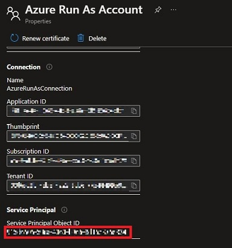

# get-retail-prices
## Purpose
Azure Automation runbook to collect and store Azure Reservation prices.

[Azure Retail Prices API](https://docs.microsoft.com/en-us/rest/api/cost-management/retail-prices/azure-retail-prices) is givingg access to all Azures prices (Reservations, Spots, Dev/Test, ...). But this API is paginated and thus cannot be easily integrated in reporting tools with connectors.

To solve it, this runbook will:
 - Call [Azure Retail Prices API](https://docs.microsoft.com/en-us/rest/api/cost-management/retail-prices/azure-retail-prices) to collect data
 - Filter on Reservations prices with EUR currency
 - Store results in a CSV file in Azure Blob Storage  

## Prerequisites
### Create and configure Azure Automation Account
Use your favorite method to create a new Azure Automation Account:
- [Azure Portal](https://docs.microsoft.com/en-us/azure/automation/automation-create-standalone-account?tabs=azureportal#create-a-new-automation-account-in-the-azure-portal) 
- [Azure CLI](https://docs.microsoft.com/fr-fr/cli/azure/automation/account?view=azure-cli-latest#az-automation-account-create)
- [Powershell](https://docs.microsoft.com/en-us/powershell/module/az.automation/new-azautomationaccount?view=azps-7.2.0)
- [Terraform](https://registry.terraform.io/providers/hashicorp/azurerm/latest/docs/resources/automation_account) 

Sample with Powershell:
```console
New-AzAutomationAccount -Name 'myAutomationAccount' -Location 'North Europe' -ResourceGroupName 'RG-CDU'
```

### Create "Run as Account"
Run As accounts in Azure Automation provides authentication for managing resources on the Azure Resource Manager using Automation runbooks.

Follow [Azure Automation Account documentation](https(https://docs.microsoft.com/en-us/azure/automatiocreate-run-as-account#create-account-in-azu)re-portal) to create an Automation Account using Azure Portal (easiest way) 

### Set "Run as Account" permissions
By default, Run as Account Service Principal will get `Contributor` permission but we only need `Storage Blob Data Contributor` permission.

These Powershell commands will remove `Contributor` and set `Storage Blob Data Contributor` permissions on Azure Automation Service Principal (aka Run As Account):
```console
Remove-AzRoleAssignment -PrincipalId "517a32bf-b44d-475e-a635-91209a190f34" -RoleDefinitionName "Contributor" 517a32bf-b44d-475e-a635-91209a190f34

New-AzRoleAssignment -PrincipalId "xxxxxxxx-xxxx-xxxx-xxxx-xxxxxxxx" -RoleDefinitionName "Storage Blob Data Contributor"
```

*You can easily find Service Principal ID in Run as Account blade on Azure Portal*



### Configure Automation Account 
Define variables:
 - `StorageAccountName` = Name of the Storage Account to store retail price CSV file 
```console 
New-AzAutomationVariable -AutomationAccountName "myAutomationAccount" -Name "StorageAccountName" -Encrypted $False -Value "myStorageAccountName" -ResourceGroupName "RG-CDU"
```
 - `ContainerName` = Name of the Container (inside Storage Account) to store retail price CSV file 
```console
New-AzAutomationVariable -AutomationAccountName "myAutomationAccount" -Name "ContainerName" -Encrypted $False -Value "myContainerName" -ResourceGroupName "RG-CDU"
```
 - `ContainerName` = Name of the Container (inside Storage Account) to store retail price CSV file 
```console
New-AzAutomationVariable -AutomationAccountName "myAutomationAccount" -Name "ContainerName" -Encrypted $False -Value "myContainerName" -ResourceGroupName "RG-CDU"
```
 - `Currency` = Currency for returned price list  
```console
New-AzAutomationVariable -AutomationAccountName "myAutomationAccount" -Name "Currency" -Encrypted $False -Value "EUR" -ResourceGroupName "RG-CDU"
```

## Deploy
### Create Powershell runbook
Download Powershell script:
```console
wget https://github.com/cdupui/reservation-alerts/blob/main/reservation-alerts.ps1   
```

Go to the directory where you downloaded `reservation-alerts.ps1` and execute Powershell command to create and deploy Azure Automation Powershell runbook: 
```console
$importParams = @{
    Path = "reservation-alerts.ps1"
    ResourceGroupName = "RG-CDU"
    AutomationAccountName = "myAutomationAccount"
    Type = "PowerShell"
}
Import-AzAutomationRunbook @importParams
```
### Test Powershell runbook
In Azure Portal, Go to the runbook Editor see [Edit runbook documentation](https://docs.microsoft.com/en-us/azure/automation/automation-edit-textual-runbook#edit-a-runbook-with-the-azure-portal)  

Then use Test Pane to execute runbook and check results see [Test runbook documentation](https://docs.microsoft.com/en-us/azure/automation/manage-runbooks#test-a-runbook) 

If a reservation usage is below specified threshold you should see an alert message in Teams channel


## Finalize runbook execution
### Publish runbook
If all tests are fine, you have to publish your runbook to finalize deployment see [Publish runbook documentation](https://docs.microsoft.com/en-us/azure/automation/manage-runbooks#publish-a-runbook)  

### Schedule execution
Last optional (but recommended) step is to schedule this runbook to get daily alerts if your reservations are not used as expected see [Schedule runbook documentation](https://docs.microsoft.com/en-us/azure/automation/manage-runbooks#schedule-a-runbook-in-the-azure-portal) 
